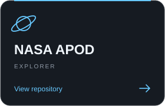

 

  <!-- Typing SVG by DenverCoder1 - https://github.com/DenverCoder1/readme-typing-svg -->
  

<h2 align="center">My projects</h2>

<table align="center">
  <tr>
    <td align="center">
       
      
      
    </td>
    <td align="center">
       
      
      
    </td>
    <td align="center">
       
      
      
    </td>
  </tr>
</table>

 
 
<h2 align="center"> Stuff I know (and I'm still exploring) 🔍</h2>

 

  

<h2 align="center"> Stuff I,m learning 📈</h2>

 

  

<h2 align="center"> Want to learn 🧠</h2>

 

  

 
